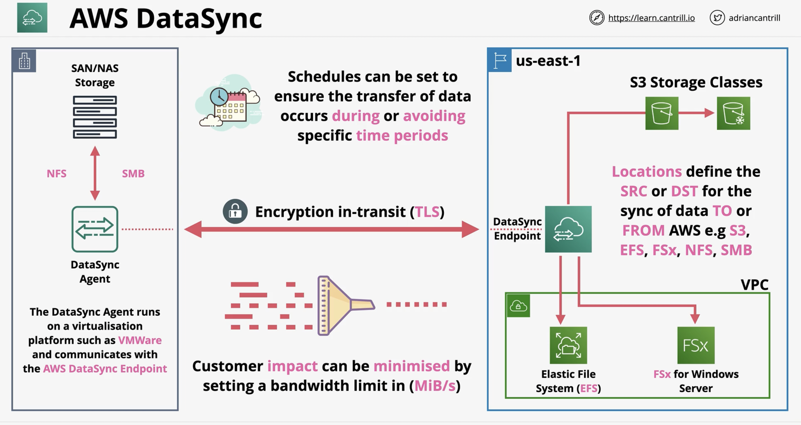

# AWS DataSync

- It is a data transfer service which allows data to be transferred into or out of AWS
- Can be used for workflows such as migrations, data processing transfers, archival, cost effective storage, DR/BC
- Each agent can handle 10 Gbps transfer speed, each job can handle 15 million files
- It also handles the transfer of metadata (permissions, timestamps)
- It provides built in data validation

## Key Features

- Scalable: 10 Gbps per agent (~100 TB of data per day)
- Bandwidth Limiters: used to avoid link saturation
- Incremental and scheduled transfer options
- Compressions and encryption
- Automatic recovery from transit errors
- Service integration: S3, EFS, FSx, service-to-service transfer
- Pay as you use service: per GB of data transferred
- The DataSync agent runs on a virtualization platform such as VMWare

## DataSync Components

- Task: a job within DataSync, defines what is being synced, how quickly, from where and to where
- Agent: software used to read or write to on-premises data stores using NFS or SMB
- Location: every task has two locations from and to, examples: Network File System (NFS), Server Message Block (SMB), Amazon EFS, Amazon FSx and Amazon S3
